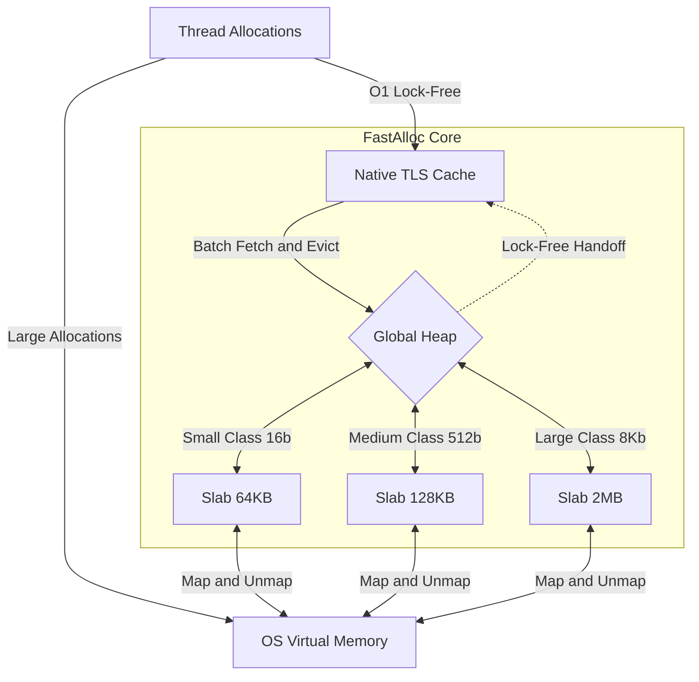

# FastAlloc
*A High-Performance, Thread-Safe C++ Memory Allocator*

FastAlloc is a custom-built memory allocator designed as a drop-in replacement for standard `malloc` and `free`. It avoids OS overhead by leveraging low-level OS utilities (`VirtualAlloc` on Windows, `mmap` on Linux) mapped to heavily-optimized caching and concurrency synchronization techniques.

## Architecture Highlights
- **O(1) Lock-Free Fast Path:** By utilizing Platform-Native TLS (FLS on Windows, Pthreads on Linux), thread-specific block caches bypass mutex locks completely. The implementation is hardened against loader-lock deadlocks on Windows/MinGW.
- **Dynamic Slab Sizing:** OS-level memory mappings scale dynamically based on allocation size. Small objects stay lean on 64KB slabs, while larger objects scale up to 2MB to maintain peak performance without fragmentation.
- **Anti-Hoarding Caches:** Thread caches use adaptive thresholds. Tiny objects are cached aggressively (256 blocks), while large objects (>4KB) are strictly limited (8 blocks) to prevent threads from hoarding physical memory in high-concurrency environments.
- **Lock-Free Handoff & Stability:** Dying threads return memory via a lock-free MPSC `pending_returns_` queue. The Global Heap also defers OS `VirtualFree`/`munmap` calls until after releasing the global mutex to maximize throughput and prevent re-entrant system deadlocks.
- **Embedded Metadata & Alignment:** FastAlloc deducts metadata on `free()` requests using inline negative offsets. Memory boundaries are strictly mathematically aligned ensuring SIMD-vectorization safety.
- **Platform Native:** Natively handles Windows through `VirtualAlloc`/`FlsAlloc` and POSIX compliant systems through `mmap`/`pthread_key`.

## System Flow Diagram



## Usage Overview
```cpp
#include "fast_alloc.h"

int main() {
    // Basic explicit allocation
    void* my_data = FastAlloc::fast_malloc(128); 
    FastAlloc::fast_free(my_data);

    return 0;
}
```

*Optionally*, by defining `FAST_ALLOC_OVERRIDE_NEW` during configuration, all standard `new` and `delete` operators globally route through FastAlloc automatically, injecting high performance into third party libraries instantly.

## Quick Start (CMake)

Requires C++17 or higher.

```bash
git clone https://github.com/yourusername/FastAlloc.git
cd FastAlloc

# Configure Project
cmake -B build
# Build (Release Mode Recommended)
cmake --build build --config Release
```

## Running Tests and Benchmarks
This project configures `FetchContent` to dynamically isolate and link **Google Test** and **Google Benchmark**. 

**Verify Memory Integrity (GTest):**
```bash
ctest --test-dir build -C Release -V
```

**Compare Against System Default Allocators (GBench):**
```bash
# Windows (Release)
.\build\Release\fast_alloc_bench.exe  # MSVC
.\build\fast_alloc_bench.exe          # MinGW/Ninja

# Linux
./build/fast_alloc_bench
```

## License
This project is licensed under the **MIT License** - see the [LICENSE](LICENSE) file for details.
