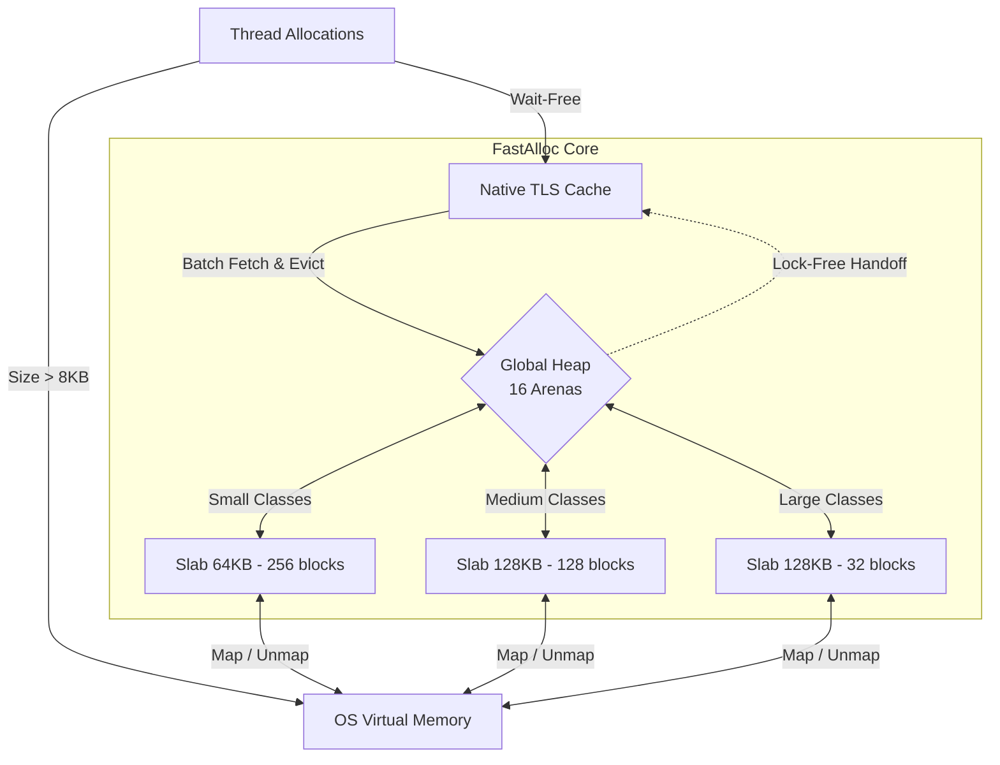

<div align="center">
  <h1>FastAlloc</h1>
  <p><b>A High-Performance, Thread-Safe C++ Memory Allocator</b></p>
  
  [](LICENSE)
  []()
  []()
</div>

<br>

**FastAlloc** is a custom-built, ultra-low-latency memory allocator designed as a drop-in replacement for standard `malloc` and `free`. By combining platform-native Thread-Local Storage (TLS) caching with lock-free data structures and aggressive OS memory unmapping, FastAlloc drastically reduces memory fragmentation and OS-level overhead under heavy multi-threaded contention.

---

## Key Features & Architecture

FastAlloc is engineered for extreme multi-core scalability:

- **Wait-Free Fast Path:** Utilizing platform-native TLS (FLS on Windows, Pthreads on Linux), thread-specific caches allow the vast majority of allocations and deallocations to bypass mutex locks completely.
- **Adaptive Slab Sizing:** OS-level memory mappings scale dynamically based on allocation size. Small objects use 64KB slabs, while larger objects scale up to 128KB (and up to 2MB dynamically). This balances throughput with memory efficiency, saving massive amounts of virtual memory versus fixed-density slabs.
- **Lock-Free Memory Handoff:** Returning memory to other arenas is handled via isolated, lock-free MPSC (Multi-Producer, Single-Consumer) pending queues (`std::atomic::compare_exchange_weak`), eliminating O(N²) lock contention when threads deallocate cross-thread.
- **Aggressive Memory Unmapping:** FastAlloc guarantees aggressive return of empty slabs to the OS *outside* the critical path spinlocks, ensuring a memory footprint often smaller than the system `malloc`.
- **Out-of-Lock OS Allocation:** Critical system calls (`VirtualAlloc` / `mmap`) are executed entirely outside global spinlocks, ensuring that slow OS page mapping never blocks other threads from accessing the global heap.
- **Exponential Spinlock Backoff:** Global stripe locks implement hardware-aware backoff (using `_mm_pause()` / `__builtin_ia32_pause()`) and `std::this_thread::yield()`, drastically improving stability under extreme contention.

## System Architecture



## Quick Start

FastAlloc is built using CMake and requires **C++17** or higher.

### Building from Source

```bash
git clone https://github.com/yourusername/FastAlloc.git
cd FastAlloc

# Configure the project
cmake -B build

# Build (Release Mode Recommended for Performance)
cmake --build build --config Release
```

## Usage

FastAlloc provides a direct C-style API mapping to standard memory functions.

### Basic C-API
```cpp
#include "fast_alloc.h"

int main() {
    // Allocate 128 bytes
    void* my_data = FastAlloc::fast_malloc(128); 
    
    // Use the memory...

    // Free the memory
    FastAlloc::fast_free(my_data);

    // Calloc and Realloc are also supported:
    // void* data = FastAlloc::fast_calloc(10, sizeof(int));
    // void* resized = FastAlloc::fast_realloc(data, 256);

    return 0;
}
```

### Global `new`/`delete` Override

You can seamlessly route all standard C++ `new` and `delete` operators through FastAlloc to instantly inject high performance into third-party libraries and existing codebases.

To enable this, compile your project with the macro definition `FAST_ALLOC_OVERRIDE_NEW`:

```cpp
// When FAST_ALLOC_OVERRIDE_NEW is defined:
int* numbers = new int[1000]; // Automatically uses FastAlloc::fast_malloc
delete[] numbers;             // Automatically uses FastAlloc::fast_free
```

## Testing & Benchmarks

The project uses CMake's `FetchContent` to dynamically isolate and link **Google Test** and **Google Benchmark**.

### Verify Memory Integrity (GTest)
```bash
ctest --test-dir build -C Release -V
```

### Run Benchmarks (GBench)
Compare FastAlloc directly against your system's default allocator:
```bash
# Windows (MSVC)
.\build\Release\fast_alloc_bench.exe

# Linux
./build/fast_alloc_bench
```
*Note: FastAlloc typically outperforms standard system `malloc` by up to **3.95x** under heavy 16-thread contention.*

## Documentation

For in-depth explanations of FastAlloc's internal mechanics, refer to the docs:
- [Performance & Benchmark Report](docs/performance_report.md)
- [Technical Design Document](docs/technical_design.md)
- [QA & Memory Safety Report](docs/qa_report.md)
- [API Reference Guide](docs/api_reference.md)

## License

This project is licensed under the **MIT License** - see the [LICENSE](LICENSE) file for details.
