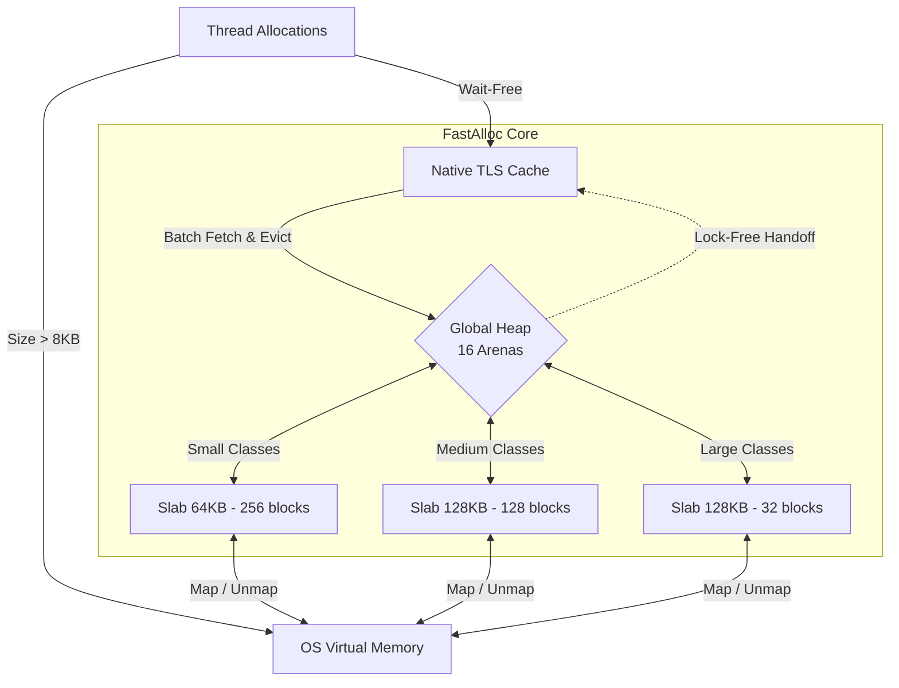

<div align="center">
  <h1>FastAlloc</h1>
  <p><b>A High-Performance, Thread-Safe C++ Memory Allocator</b></p>
  
  [](LICENSE)
  []()
  []()
  [](.github/workflows/ci.yml)
</div>

<br>

**FastAlloc** is a custom-built, ultra-low-latency memory allocator designed as a drop-in replacement for standard `malloc` and `free`. By combining platform-native Thread-Local Storage (TLS) caching with targeted lock-free structures and bounded OS-memory caching, FastAlloc reduces allocator overhead under heavy multi-threaded contention. It ships with a full memory-safety instrumentation mode, an 86-case Google Test suite, sanitizer-clean (ASan/UBSan/TSan/LSan) verification in CI, and a one-command cross-allocator benchmark verdict tool.

---

## Key Features & Architecture

FastAlloc is engineered for extreme multi-core scalability:

- **Wait-Free Fast Path:** Utilizing platform-native TLS (FLS on Windows, Pthreads on Linux), thread-specific caches allow the vast majority of allocations and deallocations to bypass mutex locks completely.
- **Adaptive Slab Sizing:** OS-level memory mappings scale dynamically based on allocation size. Small objects use 64KB slabs, while larger objects scale up to 128KB (and up to 2MB dynamically). This balances throughput with memory efficiency, saving massive amounts of virtual memory versus fixed-density slabs.
- **Lock-Free Memory Handoff:** Returning memory to other arenas is handled via isolated, lock-free MPSC (Multi-Producer, Single-Consumer) pending queues (`std::atomic::compare_exchange_weak`), eliminating O(N²) lock contention when threads deallocate cross-thread.
- **Aggressive Memory Unmapping:** FastAlloc guarantees aggressive return of empty slabs to the OS *outside* the critical path spinlocks, ensuring a memory footprint often smaller than the system `malloc` — measured 16 MB retained after purging a 1M-object workload vs 46.7 / 171.8 / 552.2 MB for glibc / jemalloc / mimalloc.
- **Out-of-Lock OS Allocation:** Critical system calls (`VirtualAlloc` / `mmap`) are executed entirely outside global spinlocks, ensuring that slow OS page mapping never blocks other threads from accessing the global heap.
- **Exponential Spinlock Backoff:** Global stripe locks implement hardware-aware backoff (using `_mm_pause()` / `__builtin_ia32_pause()`) and `std::this_thread::yield()`, drastically improving stability under extreme contention.
- **Memory-Safety Instrumentation (`FASTALLOC_DEBUG`):** front canaries, rear red zones, freed-block poisoning (use-after-free detection), slab/large-header magic validation, an exact allocation registry with double-free/invalid-free detection, leak reporting, a full statistics API and level-gated logging — all compiled out in release builds.
- **Deterministic OOM Behaviour:** allocation failure returns `nullptr` cleanly; the allocator stays usable (verified by an OOM-injection test seam).
- **Bounded Retention:** the page-span cache is capped (2 MB per bin / 64 MB global, tunable) instead of retaining up to ~8 GB; `fast_alloc_purge()` returns everything to the OS on demand.
- **Aligned Allocation:** `fast_aligned_alloc` for alignments up to 4096 bytes; `fast_realloc` preserves them.
- **In-Place Large Realloc:** large blocks grow via `mremap` (Linux) and shrink by releasing tail pages, instead of always copying.
- **Tested Concurrency:** the cross-thread MPSC handoff, thread-exit flush and 8-thread contended churn are verified under ThreadSanitizer with zero races.

## System Architecture


```mermaid
flowchart TD
    User[Thread Allocations] -->|Wait-Free| TLS[Native TLS Cache]
    User -->|Size > 8KB| OS
    
    subgraph FastAlloc Core
        TLS -->|Batch Fetch & Evict| GH{Global Heap\n16 Arenas}
        GH -.->|Lock-Free Handoff| TLS
        
        GH <-->|Small Classes| S1[Slab 64KB - 256 blocks]
        GH <-->|Medium Classes| S2[Slab 128KB - 128 blocks]
        GH <-->|Large Classes| S3[Slab 128KB - 32 blocks]
    end
    
    S1 <-->|Map / Unmap| OS[OS Virtual Memory]
    S2 <-->|Map / Unmap| OS
    S3 <-->|Map / Unmap| OS
```

## Quick Start

FastAlloc is built using CMake and requires **C++17** or higher.

### Building from Source

```bash
git clone https://github.com/yourusername/FastAlloc.git
cd FastAlloc

# Configure the project
cmake -B build

# Build (Release Mode Recommended for Performance)
cmake --build build --config Release
```

## Usage

FastAlloc provides a direct C-style API mapping to standard memory functions.

### Basic C-API
```cpp
#include "fast_alloc.h"

int main() {
    // Allocate 128 bytes
    void* my_data = FastAlloc::fast_malloc(128); 
    
    // Use the memory...

    // Free the memory
    FastAlloc::fast_free(my_data);

    // Calloc and Realloc are also supported:
    // void* data = FastAlloc::fast_calloc(10, sizeof(int));
    // void* resized = FastAlloc::fast_realloc(data, 256);

    return 0;
}
```

### Global `new`/`delete` Override

You can seamlessly route all standard C++ `new` and `delete` operators through FastAlloc to instantly inject high performance into third-party libraries and existing codebases.

To enable this, compile your project with the macro definition `FAST_ALLOC_OVERRIDE_NEW`:

```cpp
// When FAST_ALLOC_OVERRIDE_NEW is defined:
int* numbers = new int[1000]; // Automatically uses FastAlloc::fast_malloc
delete[] numbers;             // Automatically uses FastAlloc::fast_free
```

## Testing & Benchmarks

The project uses CMake's `FetchContent` to dynamically isolate and link **Google Test** and **Google Benchmark**.

### Verify Memory Integrity (GTest)
```bash
ctest --test-dir build -C Release -V
```

### Run Benchmarks

**One command — every benchmark, full win/loss verdict report:**

```bash
python3 benchmarks/benchsuite/bench_compare.py \
    --mimalloc-so /path/to/libmimalloc.so.2   # (auto-detects if installed)
    --reps 5 --threads 1,2,4
```

`bench_compare.py` is the single verdict tool: it runs the two Google-Benchmark
micro-suites (std vs FastAlloc, 92 paired configs), the full cross-allocator
`bench_suite` matrix (11 workloads × {1,2,4} threads × glibc / jemalloc /
mimalloc / FastAlloc, one allocator per process, median of 5 reps,
checksum-guarded), and the side-by-side memory stress benchmark, then prints
a per-category verdict with the exact multiplier for **every** type — e.g.
`MallocOnly 16B T=1: FastAlloc wins by 1.29x`, `Realloc 512B T=1: std wins
by 1.29x`, `purge-retention vs mimalloc: FastAlloc keeps 34.5x LESS memory`.
It writes `bench_report.md`, chart-ready `bench_report_data.json` and raw
JSONL. Long sessions can be chunked (`--workloads churn,tiny`,
`--suite-skip-run`, `--gbench-cache`) and `--quick` gives a smoke preset.

**Individual suites** (what the tool drives under the hood):

```bash
# 1. Legacy GBench microbenchmarks (fast-path LIFO batches)
./build/fast_alloc_bench
./build/fast_alloc_bench_extended

# 2. Side-by-side memory stress (time + peak RSS)
./build/fast_alloc_bench_memory --threads 4 --allocs 20000 --size 4096

# 3. Rigorous cross-allocator suite (bench_suite): 11 Larsson/mimalloc-bench
#    style workloads against glibc / jemalloc / mimalloc via LD_PRELOAD,
#    one allocator per process, JSONL output:
cmake --build build --target bench_suite -j
./build/bench_suite --alloc fast --label FastAlloc --workload churn --threads 4 --reps 5 --json results.jsonl
LD_PRELOAD=/lib/x86_64-linux-gnu/libjemalloc.so.2 ./build/bench_suite --alloc std --label jemalloc --workload churn --threads 4 --reps 5 --json results.jsonl

# 4. Cross-allocator matrix driver + analyzer (CI's benchmark-matrix job)
cd benchmarks/benchsuite && bash ./run_matrix.sh results.jsonl 5
python3 analyze.py results.jsonl
```

*Note (honest, re-measured 2026-09-10 on a 2-vCPU VM vs glibc 2.41 /
jemalloc 5.3.0 / mimalloc 2.1.7, median of 5, one allocator per process):*
FastAlloc **wins 20/33 throughput cells vs glibc, 21/33 vs jemalloc and
12/33 vs mimalloc**. It is fastest in every small-block pair workload at
every thread count (small-mixed 1.24–1.51x vs glibc; random 1–4096 B up to
2.98x; ramp 1.54–1.94x; churn beats glibc at T=1/2 and ties at T=4), has the
best p50/p99 tail latency of all four allocators, is 4.6–14.6x faster than
jemalloc/mimalloc on large-block cycles, and retains **2.9x/10.7x/34.5x
less RSS** than glibc/jemalloc/mimalloc after freeing 1M objects and
purging (16.0 MB vs 46.7/171.8/552.2 MB). It is **not** fastest for
realloc-heavy code (glibc 0.28x — contiguous heap grows in place; ties
mimalloc, beats jemalloc 1.25x), for constant-live-set churn against
jemalloc/mimalloc's private-arena design (0.55–0.75x), for ramp against
mimalloc's thread-local heap (0.36–0.51x), for bulk free storms (0.66x —
the price of the memory-return win), or for thread spawn/exit storms vs
glibc's minimal tcache (0.48–0.62x; still 2.2–2.6x faster than jemalloc) —
see [docs/performance_report.md](docs/performance_report.md) for the full
win/loss matrices, latency/memory/thread-lifecycle sections, charts and
root causes.

## Documentation

For in-depth explanations of FastAlloc's internal mechanics, refer to the docs:
- [Performance & Benchmark Report](docs/performance_report.md) (with charts in `docs/charts/`)
- [Technical Design Document](docs/technical_design.md)
- [QA & Memory Safety Report](docs/qa_report.md)
- [API Reference Guide](docs/api_reference.md)

Benchmark charts (regenerated 2026-09-10, in `docs/charts/`):
- [Speedup heatmap (vs all three allocators)](docs/charts/speedup_heatmap.png)
- [Latency percentiles](docs/charts/latency.png)
- [Thread scaling](docs/charts/scaling.png)
- [Memory footprint & retention](docs/charts/memory.png)
- [Thread lifecycle](docs/charts/thread_lifecycle.png)
- [Microbenchmark family verdicts](docs/charts/gbench_verdicts.png)

## License

This project is licensed under the **MIT License** - see the [LICENSE](LICENSE) file for details.


---

## Verification Matrix (v2.0.0, re-verified 2026-09-10)

| Configuration | Tests | Status |
| :--- | :--- | :--- |
| Release (`-O3 -march=native` + LTO, `-Wall -Wextra -Werror`) | 75 | all pass, zero warnings |
| Debug instrumentation (`FASTALLOC_DEBUG`) | 86 (incl. death tests; 1 debug-only skip by design) | all pass |
| AddressSanitizer + UBSan | 75 | zero memory errors |
| ThreadSanitizer | 75 | **zero data races** |
| LeakSanitizer | 75 | zero leaks |
| Benchmark checksums (132 suite cells + 92 gbench configs) | — | zero failures |

CI (all 16 jobs green on every push): ubuntu/windows × release/debug +
clang builds, windows-msvc-asan (3x repeat), ASan+UBSan, TSan, LSan,
Windows-VA emulation, and both benchmark jobs that execute *every*
benchmark binary — see `docs/qa_report.md` §4 for the job table.

Reproduce locally:

```bash
cmake -B build -DFASTALLOC_DEBUG=ON && cmake --build build && ctest --test-dir build --output-on-failure
cmake -B build-asan -DFASTALLOC_SANITIZE=address,undefined && cmake --build build-asan && ctest --test-dir build-asan
cmake -B build-tsan -DFASTALLOC_SANITIZE=thread && cmake --build build-tsan && ctest --test-dir build-tsan
cmake -B build-lsan -DFASTALLOC_SANITIZE=leak && cmake --build build-lsan && ctest --test-dir build-lsan
```

See `docs/qa_report.md` for the full, evidence-backed QA report and
`docs/api_reference.md` for the complete API contract (zero-size semantics,
OOM behaviour, diagnostics API).
